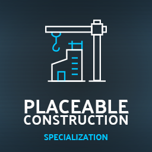
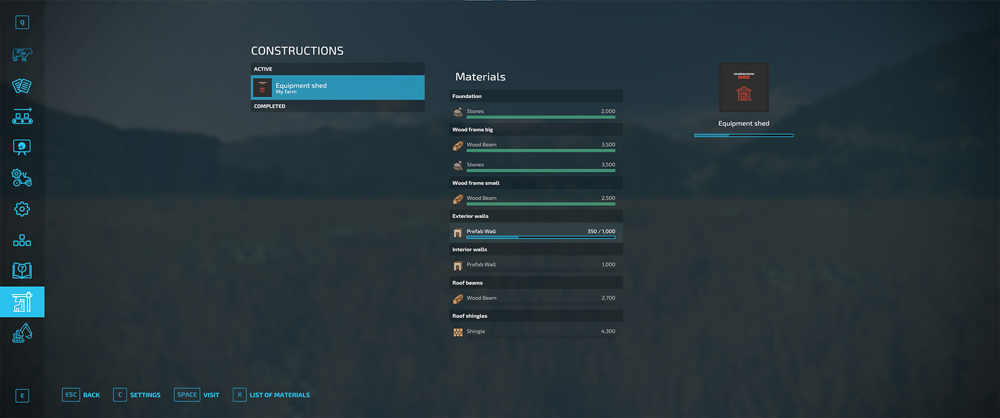
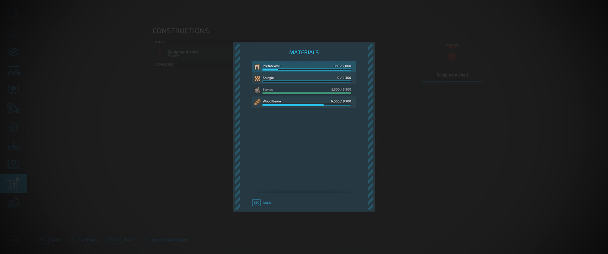
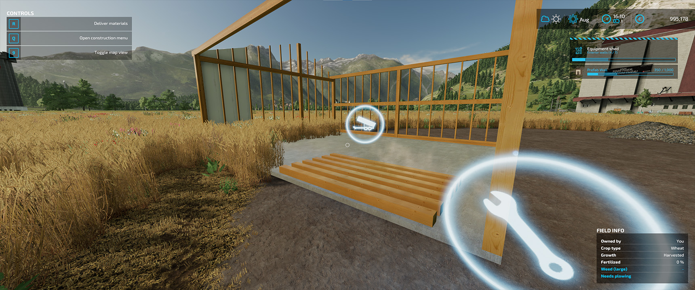

# Placeable Construction

Specialization for placeable constructions.

Project is in BETA phase and intended for modders to start creating placeable constructions and give feedback.

```
author: scfmod
url:    https://github.com/scfmod/FS22_TerraFarm

If you distribute this mod, always include this info.

AND DO NOT UPLOAD IT TO MONATERY UPLOAD SERVICES.
THIS CODE IS AVAILABLE TO ANYONE FOR FREE AND YOU CAN USE
IT TO LEARN, FORK AND SPREAD THE KNOWLEDGE.
```

## Documentation

For implementation details and examples: [docs/INDEX.md](./docs/INDEX.md)

Example mod with a shed: [FS22_PlaceableConstructionSheds.zip](https://github.com/scfmod/FS22_PlaceableConstruction/releases/download/example_1/FS22_PlaceableConstructionSheds.zip)

## Images



